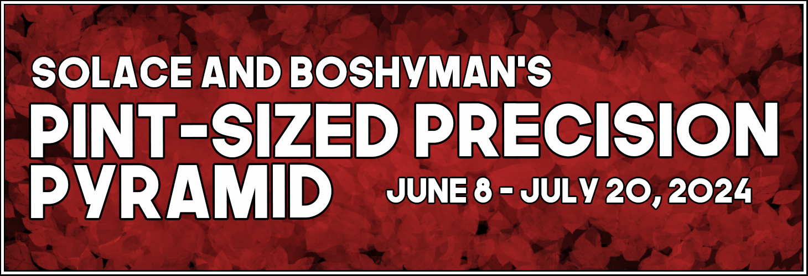

---
tags:
  - PPP
---

# Pint-Sized Precision Pyramid

The **Pint-Sized Precision Pyramid** (**_PPP_**) is a 1v1 osu!standard double-elimination tournament hosted by ::{ flag=US }:: [Sohlayce](https://osu.ppy.sh/users/17649736) & ::{ flag=US }:: [BoshyMan741](https://osu.ppy.sh/users/4830687). It is the first instalment of the Pint-Sized Precision Pyramid.

## Tournament schedule

|              Event | Timestamp             |
| -----------------: | :-------------------- |
| Registration phase | 2024-05-11/2024-05-24 |
|         Qualifiers | 2024-06-8/2024-06-9   |
|        Round of 32 | 2024-06-15/2024-06-16 |
|        Round of 16 | 2024-06-22/2024-06-23 |
|      Quarterfinals | 2024-06-29/2024-06-30 |
|         Semifinals | 2024-07-06/2024-07-07 |
|             Finals | 2024-07-13/2024-07-14 |
|       Grand Finals | 2024-07-20/2024-07-21 |

## Prizes

|                          Placing                           | Prize(s)                                                 |
| :--------------------------------------------------------: | :------------------------------------------------------- |
|      | Profile banner, Profile badge, 6 months of osu!supporter |
|  | Profile banner, 4 months of osu!supporter                |
|  | Profile banner, 2 months of osu!supporter                |

 <!-- remove if not available -->

## Organisation

The Pint-Sized Precision Pyramid is run by various community members.

| Position         | Member(s)                                                                                                                                                                                                                                                                                                                                                                                                                                                                                                                                                                                                                                                                                                                                                           |
| :--------------- | :------------------------------------------------------------------------------------------------------------------------------------------------------------------------------------------------------------------------------------------------------------------------------------------------------------------------------------------------------------------------------------------------------------------------------------------------------------------------------------------------------------------------------------------------------------------------------------------------------------------------------------------------------------------------------------------------------------------------------------------------------------------ |
| Host             | ::{ flag=US }:: [Sohlayce](https://osu.ppy.sh/users/17649736), ::{ flag=US }:: [BoshyMan741](https://osu.ppy.sh/users/4830687)                                                                                                                                                                                                                                                                                                                                                                                                                                                                                                                                                                                                                                      |
| Mappool selector | ::{ flag=US }:: [BoshyMan741](https://osu.ppy.sh/users/4830687), ::{ flag=US }:: [EthantrixV2](https://osu.ppy.sh/users/10634348), ::{ flag=US }:: [rng\_](https://osu.ppy.sh/users/9265990), ::{ flag=US }:: [-Tynamo](https://osu.ppy.sh/users/3638962)                                                                                                                                                                                                                                                                                                                                                                                                                                                                                                           |
| Custom mapper    | ::{ flag=US }:: [BoshyMan741](https://osu.ppy.sh/users/4830687), ::{ flag=US }:: [-Tynamo](https://osu.ppy.sh/users/3638962), ::{ flag=US }:: [BATBALL](https://osu.ppy.sh/users/15173952), ::{ flag=UK }:: [moonpoint](https://osu.ppy.sh/users/9558549), ::{ flag=NL }:: [lazysloth900](https://osu.ppy.sh/users/4502522), ::{ flag=CA }:: [a bat](https://osu.ppy.sh/users/13531879), ::{ flag=HU }:: [beans mcCheese](https://osu.ppy.sh/users/13201170), ::{ flag=KR }:: [Luscent](https://osu.ppy.sh/users/2688581), ::{ flag=US }:: [squirrelpascals](https://osu.ppy.sh/users/6151332), ::{ flag=US }:: [Rentai](https://osu.ppy.sh/users/11033243)                                                                                                         |
| Streamer         | ::{ flag=US }:: [Kahli](https://osu.ppy.sh/users/8926244), ::{ flag=US }:: [EthantrixV2](https://osu.ppy.sh/users/10634348), ::{ flag=CH }:: [Bastaku](https://osu.ppy.sh/users/14351782), ::{ flag=US }:: [NHE Silent](https://osu.ppy.sh/users/20345199), ::{ flag=TH }:: [steved](https://osu.ppy.sh/users/4859362)                                                                                                                                                                                                                                                                                                                                                                                                                                              |
| Commentator      | ::{ flag=ID }:: [BlankTap](https://osu.ppy.sh/users/10137131), ::{ flag=US }:: [NHE Silent](https://osu.ppy.sh/users/20345199), ::{ flag=BR }:: [-felicia](https://osu.ppy.sh/users/10157694), ::{ flag=US }:: [hubbawubba](https://osu.ppy.sh/users/15910288), ::{ flag=US }:: [fieryrage](https://osu.ppy.sh/users/3533958), ::{ flag=TH }:: [steved](https://osu.ppy.sh/users/4859362), ::{ flag=RU }:: [-Hindeko](https://osu.ppy.sh/users/14220803)                                                                                                                                                                                                                                                                                                            |
| Graphic design   | ::{ flag=US }:: [Sohlayce](https://osu.ppy.sh/users/17649736), ::{ flag=FR }:: [sumida](https://osu.ppy.sh/users/18607342)                                                                                                                                                                                                                                                                                                                                                                                                                                                                                                                                                                                                                                          |
| Referee          | ::{ flag=US }:: [Sohlayce](https://osu.ppy.sh/users/17649736), ::{ flag=US }:: [rng\_](https://osu.ppy.sh/users/9265990), ::{ flag=CH }:: [Bastaku](https://osu.ppy.sh/users/14351782), ::{ flag=US }:: [NHE Silent](https://osu.ppy.sh/users/20345199), ::{ flag=CL }:: [Isita](https://osu.ppy.sh/users/13973026), ::{ flag=RU }:: [-Hindeko](https://osu.ppy.sh/users/14220803), ::{ flag=MX }:: [-Cazik-](https://osu.ppy.sh/users/17577814), ::{ flag=FR }:: [Emezys](https://osu.ppy.sh/users/5054244), ::{ flag=SK }:: [Mavosiik](https://osu.ppy.sh/users/18927594), ::{ flag=US }:: [bleph](https://osu.ppy.sh/users/18067392), ::{ flag=FR }:: [Aidown](https://osu.ppy.sh/users/1522146), ::{ flag=KR }:: [Yuno13\_](https://osu.ppy.sh/users/11932068), |
| Playtester       | ::{ flag=US }:: [BoshyMan741](https://osu.ppy.sh/users/4830687), ::{ flag=US }:: [hydrogen bomb](https://osu.ppy.sh/users/7813296), ::{ flag=US }:: [Librarian](https://osu.ppy.sh/users/10083084)                                                                                                                                                                                                                                                                                                                                                                                                                                                                                                                                                                  |

## Links

- [Discussion thread](https://osu.ppy.sh/community/forums/topics/1920791?n=1)
- [Spreadsheet](https://docs.google.com/spreadsheets/d/12fKhchBLXrLZO_Re6vrFobqol-RMRw8HSiyHpHNMdqU/edit?usp=sharing)
- [Livestream](https://www.twitch.tv/solacetournaments)

## Participants

<!-- for 1v1 tournaments -->

| Seed  | Members |
| :---- | :------ |
| 1-8   |         |
| 9-16  |         |
| 17-24 |         |
| 25-32 |         |

<!-- remove the following section if seeding was displayed above -->

## Podium

This competition has come to an end and resulted in the following podium:

|                          Placing                           | Player |
| :--------------------------------------------------------: | :----- |
|      |        |
|  |        |
|  |        |

 <!-- remove image if not available -->

## Mappools

### Stage

**[Download the mappack here! (SIZE)](LINK)**

- ModType
  1. [BeatmapArtist - BeatmapTitle (BeatmapCreator) [BeatmapDifficulty]](BeatmapLink)
- Tiebreaker
  1. **Beatmap**

### Qualifiers

- NM
  1. [Neutral Milk Hotel - Holland, 1945 (i shot my son) [White Roses]](https://osu.ppy.sh/b/2226025)
  2. [NIWASHI - The Fascinating Cat's Eye (fanzhen0019) [drowned in the garden]]()
  3. [Taku Inoue - Yoake made Ato 3 Byou (Nerova Riuz GX) [Dawn]]()
  4. [Tipper - Apex Of The Vortex (verychill) [Vortex]]()
- HT
  1. [Toromaru - Enigma II (bob) [chill's LIVID]]()
- HR
  1. [BUTAOTOME - In the Black (Luscent) [Delis' Extra]]()
  2. [Carpool Tunnel - Afterlight (\_Epreus) [squirrelp's Traffic Jam Dreams]]()
  3. [The Beatles - Here Comes The Sun (stackerjoe) [Comfort]]()
- DT
  1. [Sufjan Stevens - Mystery of Love (jas) [I Remember Everything]]()
  2. [Breaking Benjamin - The Diary of Jane (FCL) [Extra]]()
  3. [Ice - L2 - Ascension : Act 2 (Liberation) (Okorin) [pishi's Insane 07/16]]()
- DTHR
  1. [Bloodhound Gang - Mope (Hitoshirenu Shourai) [Insane]]()

## Match results

### Stage

Day, date: <!-- e.g. Saturday, 17 June 2018: -->

<!-- For solo tournaments, replace table header with: | Player 1 |  |  | Player 2 | Match link | -->

|                       Team 1 |                                                                                 |       | Team 2                       | Match link       |
| ---------------------------: | :-----------------------------------------------------------------------------: | :---: | :--------------------------- | :--------------- |
| **WINNER** ::{ flag=CODE }:: |                                    **SCORE**                                    | SCORE | ::{ flag=CODE }:: LOSER      | [#1](MatchLink)  |
|      LOSER ::{ flag=CODE }:: | -1 <!-- It's convention to write "-1" for forfeits, but this isn't required --> | **0** | ::{ flag=CODE }:: **WINNER** | _win by default_ |
|     TEAM_A ::{ flag=CODE }:: |                                        0                                        |   0   | ::{ flag=CODE }:: TEAM_B     | _nullified_      |

## Ruleset

### General

- This tournament is a 1v1 open rank double-elimination osu! tournament.
- All matches will use Score V2 and NF will be enforced on every map.
- All players have to treat staff members and all other players with a high level of respect. Any kind of mistreatment may result in being banned from the tournament.
- Every player is required to join the tournament Discord server.

### Mappools

- There will be a new mappool every week.
- Mappools follow the following format:

| Stage         | Maps                                         |
| :------------ | :------------------------------------------- |
| Qualifiers    | 4 NM, 3 HR, 3 DT, 1 HT, 1 DTHR               |
| Round of 32   | 4 NM, 4 HR, 4 DT, 1 HT, 1 HTHR, 1 DTHR, 1 TB |
| Round of 16   | 4 NM, 4 HR, 4 DT, 1 HT, 1 HTHR, 1 DTHR, 1 TB |
| Quarterfinals | 5 NM, 4 HR, 4 DT, 1 HT, 2 HTHR, 1 DTHR, 1 TB |
| Semifinals    | 5 NM, 4 HR, 4 DT, 1 HT, 2 HTHR, 1 DTHR, 1 TB |
| Finals        | 5 NM, 4 HR, 4 DT, 1 HT, 2 HTHR, 2 DTHR, 1 TB |
| Grand Final   | 5 NM, 4 HR, 4 DT, 1 HT, 2 HTHR, 2 DTHR, 1 TB |

### Qualifiers

- Each map will be played sequentially, in the order NM1-4, HT1, HR1-3, DT1-3, and DTHR1
- Every player will use NoFail and ScoreV2 during qualifiers.
- In the event of player disconnect, the map will be replayed after one cycle of the maps is complete for the player that disconnected.
- In the event of a second disconnect, the player's score on that map will be counted as 0.
- Qualifiers will determine seeding for the tournament: seed 1 vs. seed 32, seed 2 vs seed 31, etc.

### Match procedure

- Each player will roll when the match starts. The player with a higher roll gets to decide pick or ban order.
- The pick loser will decide the remaining order.
- Players then ban in the order chosen. For each ban, they have 120 seconds.
- After bans are done, whoever picks first will make their pick. They have 120 seconds to do so.
- ScoreV2 and NoFail are forced on every map.
- Players may choose to use HD on any map in the pool, but their score at the end of the map will be calculated as though they did not use the mod (dividing their score by 1.06).
- Players alternate picks until they reach the match's designated point count (5 in rounds of 32 and 16, 6 in quarter- and semifinals, and 7 in finals and grand finals). In the event a player runs out their pick timer, the pick will go to the other player and the rest of the match's picks will be run as normal.
- In the event that the score is tied and each player needs one additional point to win, the tiebreaker map will be played. This map allows for any mod in addition to the required NoFail.
- Since this is a precision tournament, EZ cannot be used on tiebreakers.
- In the event of a perfectly tied score, the map will be replayed.
